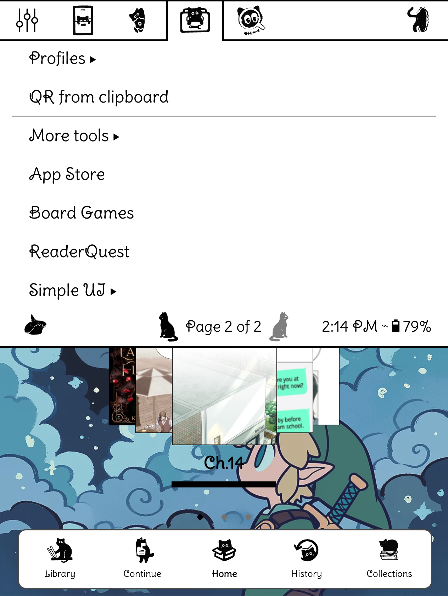
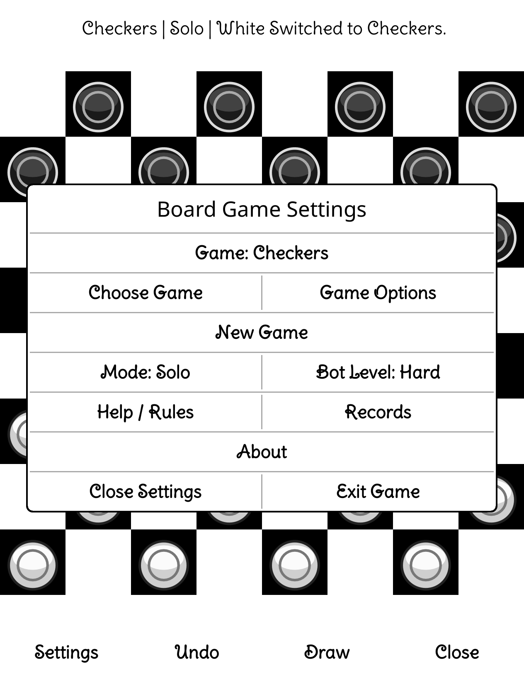
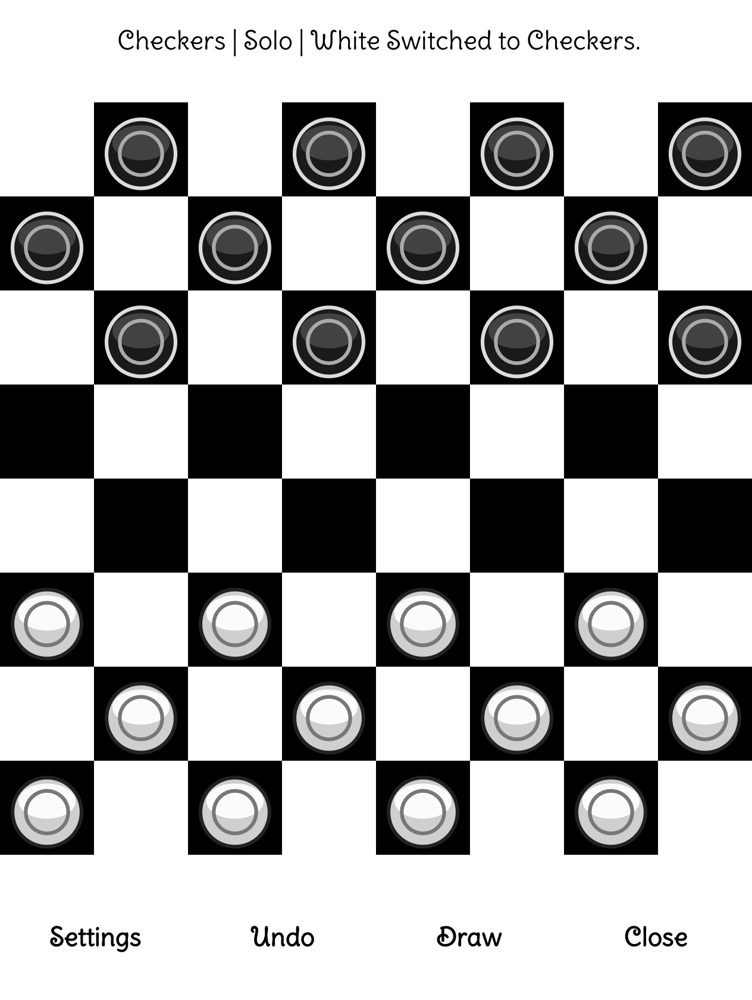
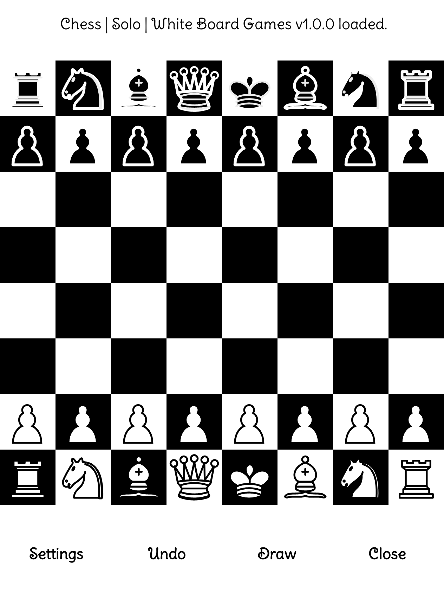
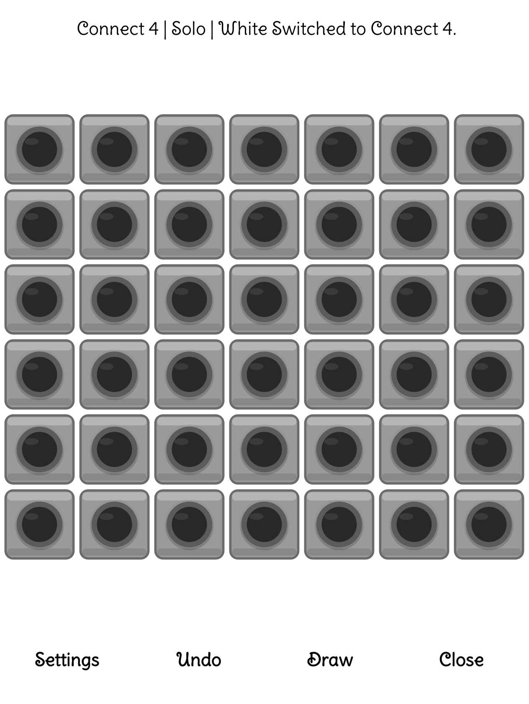
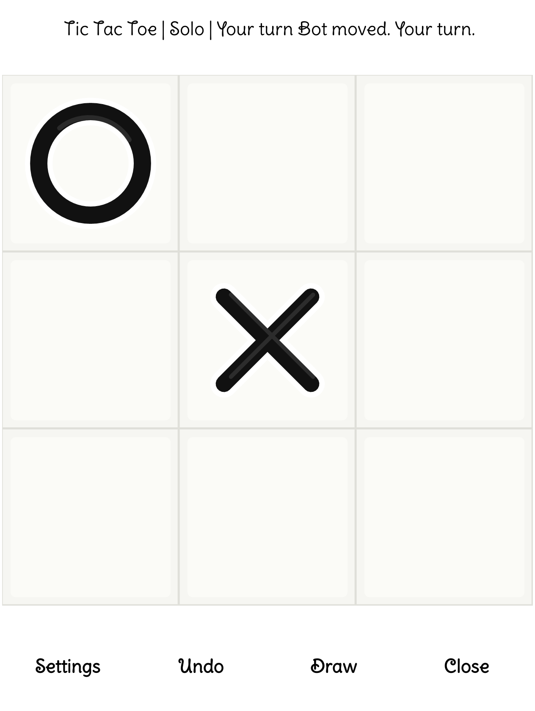
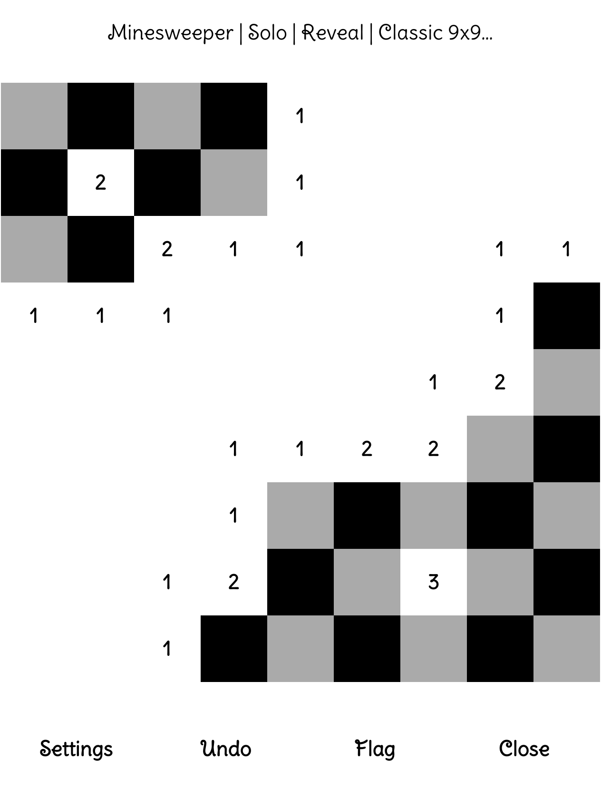
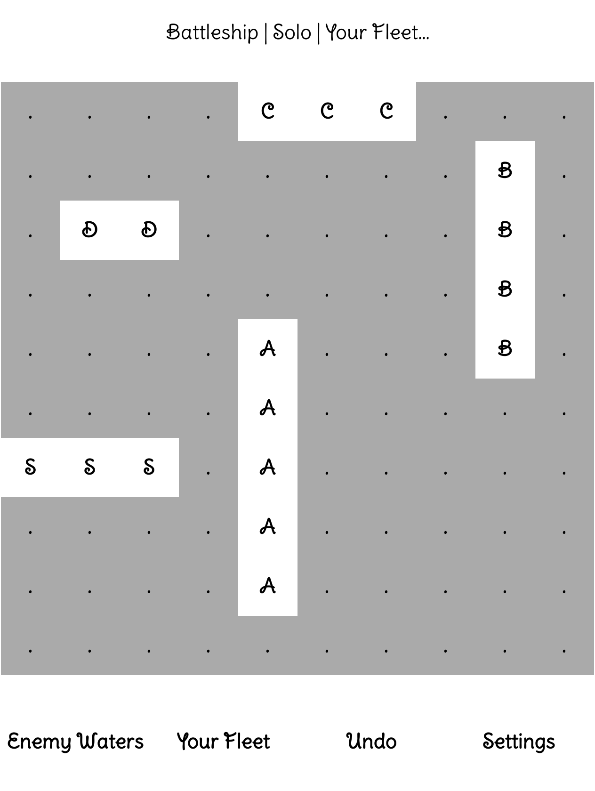

# Board Games for KOReader

> A tiny game shelf made for quiet screens.

**Version 1.0.0**  
**Made by KitanaCode**

Board Games brings six familiar games to KOReader in one simple,
e-ink-friendly plugin. Pick a game, settle in, and play without leaving your
reader.

## A Peek Inside

Here is what it looks like on an e-ink style screen:

| Tools Menu | Board Games Menu |
| --- | --- |
|  |  |

| Checkers | Chess |
| --- | --- |
|  |  |

| Connect 4 | Tic Tac Toe |
| --- | --- |
|  |  |

| Minesweeper | Battleship |
| --- | --- |
|  |  |

## What's Inside?

| Game | Ways to Play |
| --- | --- |
| Checkers | Solo or two player |
| Chess | Solo or two player |
| Connect 4 | Solo or two player |
| Tic Tac Toe | Solo or two player |
| Minesweeper | Solo puzzle |
| Battleship | Solo against the bot |

## Favorite Features

- One **Board Games** entry in the KOReader Tools menu
- A game picker, so there is no need to cycle through games
- Easy, Medium, and Hard bot settings
- Move highlighting and undo support
- Per-game Help, options, and records
- Black-and-white pieces designed for e-ink screens
- Checkers kings with clear `K` badges and continued multi-jumps
- Chess castling, en passant, and promotion options
- Classic 9x9 Minesweeper with 10 mines
- Classic 10x10 Battleship with all five standard ships

## Installation

1. Download `boardgames.koplugin.zip`.
2. Extract the `boardgames.koplugin` folder.
3. Place that folder inside KOReader's `plugins` folder.
4. Restart KOReader.
5. Open **Board Games** from the Tools menu.

The final folder should look like this:

```text
koreader/
  plugins/
    boardgames.koplugin/
      _meta.lua
      main.lua
      README.md
      screenshots/
      icons/
```

## Battleship

Battleship uses a classic 10x10 board with:

- Carrier: 5 spaces
- Battleship: 4 spaces
- Cruiser: 3 spaces
- Submarine: 3 spaces
- Destroyer: 2 spaces

### Setup Bar

- **Rotate H/V** changes the direction of the next ship.
- **Random Fleet** places every ship for you.
- **Undo** removes the last placement.
- **Settings** opens the game menu.

Choose a direction, then tap the square where the ship should begin.

### Battle Bar

- **Enemy Waters** opens the board where you fire.
- **Your Fleet** shows your ships and the bot's shots.
- **Undo** takes back the last turn.
- **Settings** opens the game menu.

`X` means hit and `o` means miss.

## Minesweeper

Minesweeper uses the classic beginner board: 9x9 with 10 mines.

- **Reveal** uncovers a square.
- **Flag** marks a suspected mine.
- Your first reveal and the surrounding squares are protected.
- Numbers tell you how many mines touch that square.
- Tap a revealed number after placing the matching number of nearby flags to
  clear the other neighboring squares.
- Reveal every safe square to win.

## A Few Notes

- Board Games is designed for grayscale and black-and-white e-ink displays.
- Your preferences and records are saved in KOReader's settings directory.
- The bundled game-piece icons are installed into KOReader's data icon
  directory when the plugin opens.
- The menu name will stay **Board Games** in future releases. Version numbers
  belong in About and release notes, where they are easier to understand.

## License

Board Games is available under the [MIT License](LICENSE).

Copyright (c) 2026 **KitanaCode**

## Thank You

Thank you for trying my little KOReader game collection. I hope it makes your
reader a bit more fun between chapters.

Made with care by **KitanaCode**.
